# Workflow-Beschreibung: AutoML Regression

Diese Datei dokumentiert den *Ablauf* des Regressions-Templates: die
empfohlene Reihenfolge der Skripte und alle Entscheidungspunkte, die kein
Skript automatisch trifft. `README.md` dokumentiert Projektidentitaet und
die `targets`-Pipeline; [`WORKFLOW_GUARDS.md`](WORKFLOW_GUARDS.md)
dokumentiert die einzelnen Guard-Skripte (`012`/`013`/`015`/`018`/`125`/
`158`) ausfuehrlicher; [`BACKLOG.md`](BACKLOG.md),
[`DATABASE.md`](DATABASE.md), [`DEVIANCE_MEASURES.md`](DEVIANCE_MEASURES.md)
und [`NEURAL_DEPLOY.md`](NEURAL_DEPLOY.md) behandeln Spezialthemen.

## Workflow-Diagramm

Ueberblick ueber den kompletten Ablauf inkl. aller Entscheidungspunkte, die
kein Skript automatisch trifft (Details siehe `WORKFLOW_GUARDS.md` und die
Bootstrap-Workflow-Liste unten). Rauten = Entscheidung, Rechtecke = Skript/
Schritt, Kapseln = Start/Ende.

```mermaid
flowchart TD
    Start(["Neues Kaggle-Projekt, Regression"]) --> Prep["Kaggle-Overview lesen<br/>Zielmetrik-Wortlaut: RMSE/MAE/Devianz?"]
    Prep --> Config["000_config.R ausfuellen<br/>id_col, target_col, baseline_measure_ids"]

    Config --> DMetric{"Ziel ist Count/Tweedie<br/>mit Nullmasse und Rechtsschiefe?"}
    DMetric -- "ja" --> Deviance["deviance_measures.R aktivieren:<br/>register_deviance_measures(), p_eval fixieren"]
    DMetric -- "nein" --> EDA
    Deviance --> EDA["010_eda.R<br/>Datenstruktur, fehlende Werte, Zielvariable"]

    EDA --> DGroup{"Mehrere Zeilen je Entitaet UND Ziel ist<br/>neue Entitaeten generalisieren,<br/>oder zeitlich/raeumlich strukturiert?"}
    DGroup -- "ja" --> GroupCV["group_resampling.R:<br/>set_group_role() + diagnose_group_cv()<br/>statt Zufalls-CV"]
    DGroup -- "nein" --> LeakAudit
    GroupCV --> LeakAudit["013_target_leak_audit.R<br/>(volle Daten, kein Subset)"]

    LeakAudit --> DLeak{"Feature &gt;50% Gain-Share ODER<br/>SD-Ratio innerhalb Wertgruppe<br/>unter 0.10 (Determinismus)?"}
    DLeak -- "ja" --> LeakFix["Verdaechtige entfernen/pruefen<br/>(ehrlich-vs-aufgeblasen Zerlegung)"]
    LeakFix --> LeakAudit
    DLeak -- "nein" --> FeatAvail["012_feature_availability_audit.R<br/>Train/Test-Paritaet, Missingness, Sentinels"]

    FeatAvail --> DAvail{"Auffaellige Missingness-Shift,<br/>Sentinel-Werte oder Spalten-Mismatch?"}
    DAvail -- "ja" --> AvailFix["Robuste Kodierung/Kennzeichnung vormerken,<br/>externe Quelle in external_source_policy klassifizieren"]
    DAvail -- "nein" --> SignalDiag
    AvailFix --> SignalDiag["015_signal_diagnostics.R<br/>CV-Mittelwertreferenz vs. Feature-Signal"]

    SignalDiag --> DSignal{"Mittelwertreferenz bereits auf Niveau<br/>von rpart/Ranger/Boosting-Modell?<br/>Signal-Gate"}
    DSignal -- "ja, kein Signal" --> MeanSub["165_mean_submission.R,<br/>KEIN Tuning/Ensemble bis neue Info<br/>oder veraenderte Feature-Repraesentation"]
    MeanSub --> LogKaggle["160_log_kaggle_submission.R<br/>submission_candidate = target_mean"]
    DSignal -- "nein, Signal vorhanden" --> AdvVal["018_adversarial_validation.R<br/>Train vs. Test unterscheidbar?<br/>+ univariate Drift-Tests je Feature"]

    AdvVal --> DAdv{"Adversarial-AUC?"}
    DAdv -- "um 0.50" --> Baselines
    DAdv -- "0.60 bis 0.70" --> AdvCare["Leichter Shift: genauer pruefen,<br/>ess_ratio auf Stabilitaet checken"]
    DAdv -- "ueber 0.70" --> AdvStrong["Starker Shift: Validierung und<br/>Features kritisch ansehen"]
    AdvCare --> Baselines
    AdvStrong --> Baselines

    Baselines["020_task.R + 030_baseline.R<br/>rpart + Ranger per 5-facher CV"] --> Boosting["080_boosting_benchmark.R<br/>LightGBM + CatBoost, je 200 Iterationen"]
    Boosting --> Tuning["100_lightgbm_tuning.R<br/>Bayesian Optimization vs. Standard-LightGBM"]

    Tuning --> DTuning{"Getunte Variante schlaegt<br/>Standard-LightGBM im CV-Vergleich?"}
    DTuning -- "ja" --> TunedWin["Getunte Variante uebernehmen<br/>(lightgbm_selection.rds)"]
    DTuning -- "nein" --> StdWin["Standard-LightGBM behalten"]
    TunedWin --> Ensemble
    StdWin --> Ensemble["110_oof_ensemble.R<br/>OOF-Mischung LightGBM + CatBoost"]

    Ensemble --> DEnsemble{"OOF-Blend schlaegt<br/>beide Einzelmodelle?"}
    DEnsemble -- "ja" --> BlendCandidate["Blend als Kandidat vormerken"]
    DEnsemble -- "nein" --> SingleCandidate["Bestes Einzelmodell bleibt Kandidat"]
    BlendCandidate --> HoldoutConfirm
    SingleCandidate --> HoldoutConfirm["120_full_holdout_confirmation.R<br/>Kandidaten auf separatem 80/20-Holdout<br/>bestaetigt, OHNE erneute Gewicht-Optimierung"]

    HoldoutConfirm --> DSegment{"segment_metric_cols gesetzt?"}
    DSegment -- "ja" --> SegmentMetrics["125_segment_metrics.R<br/>Holdout-Metriken je Segment"]
    DSegment -- "nein" --> DSanity
    SegmentMetrics --> DSegBad{"Wichtige Segmente<br/>auffaellig schlecht?"}
    DSegBad -- "ja" --> SegmentNote["Segment-Blend/Postprocessing als<br/>Folgeexperiment vormerken (BACKLOG.md)"]
    DSegBad -- "nein" --> DSanity
    SegmentNote --> DSanity
    DSanity{"perturbation_/invariance_test_cols oder<br/>directional_expectation_specs gesetzt?"}
    DSanity -- "ja" --> SanityChecks["126_sanity_checks.R<br/>Perturbation/Invarianz/Directional"]
    DSanity -- "nein" --> DConformal
    SanityChecks --> DConformal
    DConformal{"conformal_target_coverage gesetzt?"}
    DConformal -- "ja" --> ConformalIntervals["128_conformal_prediction_intervals.R<br/>Split-Conformal Prediction Intervals"]
    DConformal -- "nein" --> EnsemblePool
    ConformalIntervals --> EnsemblePool["127_ensemble_candidate_pool.R<br/>24-Modell-Pool (Ranger/LightGBM/CatBoost)"]
    EnsemblePool --> EnsembleSelection["129_ensemble_selection.R<br/>Caruana Greedy Ensemble Selection"]
    EnsembleSelection --> DEnsembleWins{"Greedy-Ensemble schlaegt<br/>bestes Einzelmodell (Bestaetigungsmenge)?"}
    DEnsembleWins -- "ja, aber noch keine Deploy-Automatisierung" --> EnsembleGap["OFFEN: 150/155 koennen bisher nur EINEN\nsubmission_model_name auf vollen Daten\ntrainieren+deployen, keine gewichtete\nMulti-Modell-Komposition - siehe BACKLOG.md"]
    DEnsembleWins -- "nein" --> NeuralGate
    EnsembleGap --> NeuralGate

    NeuralGate{"Optional, NEURAL_DEPLOY.md:<br/>GBMs zu korreliert, ca. 0.99,<br/>Blend bringt kaum mehr?"}
    NeuralGate -- "nein" --> FullTrain
    NeuralGate -- "ja" --> FTProto["FT-Transformer-Prototyp<br/>(regr.ft_transformer, mlr3torch, R/CPU, Sample)"]
    FTProto --> DDecorr{"Dekorreliert, ca. 0.9x,<br/>UND konkurrenzfaehig?"}
    DDecorr -- "nein" --> NoNeural["Kein neuronales Modell,<br/>GBM-Kandidat bleibt final"]
    DDecorr -- "ja" --> PyExport["Python-GPU-Export<br/>(MSELoss/Devianz, Mittelwert- statt Rang-Blend)"]
    NoNeural --> FullTrain
    PyExport --> FullTrain["150_train_full_model.R<br/>gewaehlter Kandidat auf allen Daten"]

    FullTrain --> Predict["155_predict_submission.R"]
    Predict --> DDiff{"158_check_submission_diff.R optional:<br/>n_different_predictions = 0?"}
    DDiff -- "ja, No-op" --> NoSubmit["NICHT einreichen"]
    DDiff -- "nein, unterscheidet sich" --> LogKaggle2["160_log_kaggle_submission.R<br/>Public-/Private-Score loggen"]
    NoSubmit --> DoneNoop(["Kein neuer Leaderboard-Versuch"])
    LogKaggle2 --> DoneFinal(["submission.csv eingereicht + geloggt"])
    LogKaggle --> DoneFinal
```

## Bootstrap-Workflow

1. `010_eda.R` prueft Datenstruktur, fehlende Werte und Zielvariable.
2. `013_target_leak_audit.R` prueft eine zu gute Baseline auf Target-Leakage
   (volle Daten, kein Subset).
3. `012_feature_availability_audit.R` vergleicht Train/Test-Spalten,
   Missingness, Sentinel-Werte und externe Quellen-Konventionen.
4. `015_signal_diagnostics.R` vergleicht die CV-Mittelwertreferenz mit dem Feature-Signal.
5. `018_adversarial_validation.R` misst, wie gut Train/Test anhand der Features
   unterscheidbar sind.
6. `020_task.R` erstellt einen 10%-`TaskRegr` aus den Rohfeatures.
7. `030_baseline.R` vergleicht rpart und Ranger (100 Baeume) per 5-facher CV.
8. `080_boosting_benchmark.R` vergleicht LightGBM und CatBoost (je 200 Iterationen).
9. `100_lightgbm_tuning.R` optimiert LightGBM per Bayesian Optimization, vergleicht es mit dem Standard-LightGBM per CV und speichert die bessere Variante.
10. `110_oof_ensemble.R` prueft eine OOF-Mischung aus der zuvor gewaehlten LightGBM-Variante und CatBoost.
11. `120_full_holdout_confirmation.R` bestaetigt die zuvor gewaehlte LightGBM-Variante, CatBoost und den festen OOF-Blend auf allen Daten per separatem 80/20-Holdout.
12. `125_segment_metrics.R` berechnet optionale Segmentmetriken fuer konfigurierte
    Spalten aus `segment_metric_cols`.
12b. `126_sanity_checks.R` berechnet optional Perturbation-/Invarianz-/
    Directional-Expectation-Tests (`perturbation_test_cols`/
    `invariance_test_cols`/`directional_expectation_specs`), baut auf dem
    `120`-Holdout-Modelle-Artefakt auf, kein erneutes Training.
12c. `128_conformal_prediction_intervals.R` berechnet optional Split-Conformal
    Prediction Intervals (`conformal_target_coverage`), baut auf dem
    `120`-Holdout auf, kein erneutes Training.
13. `150_train_full_model.R` trainiert die zuvor gewaehlte LightGBM-Variante auf allen Daten.
14. `155_predict_submission.R` schreibt die Kaggle-Submission.
15. `158_check_submission_diff.R` prueft optional, ob eine neue Submission wirklich
    von einer Referenzsubmission abweicht.
16. `165_mean_submission.R` erzeugt im No-Signal-Fall eine Mittelwert-Submission.
17. `160_log_kaggle_submission.R` protokolliert gemeldete Public-/Private-Scores fuer finale Modelle oder den Mittelwert in der SQLite-DB.

Aktueller Finalkandidat fuer S5E10 ist getuntes LightGBM: Es gewann die
unabhaengige Voll-Daten-Holdout-Bestaetigung gegen CatBoost und den OOF-Blend.

## Signal-Gate und Stop-Regel

`015_signal_diagnostics.R` ist ein frueher Entscheidungscheck, kein Modell-
Ersatz. Wenn die CV-Mittelwertreferenz bereits auf dem Niveau von rpart,
Ranger und mindestens einem nichtlinearen Boosting-Modell liegt, ist kein
robustes nutzbares Feature-Signal nachgewiesen. In diesem Fall:

1. Mit `165_mean_submission.R` eine Mittelwert-Submission als externe
   Kalibrierung erzeugen; in `160_log_kaggle_submission.R`
   `submission_candidate <- "target_mean"` setzen und ihren Kaggle-Score in
   `submission_result` speichern.
2. Bei Uebereinstimmung von CV und Leaderboard weder Hyperparameter-Tuning
   noch Ensembles oder zusaetzliche Modellfamilien starten.
3. Erst mit zusaetzlichen, wettbewerbskonformen Informationen oder einer
   veraenderten Feature-Repraesentation erneut experimentieren.

Die Regel verhindert blindes Tuning, ist aber bewusst keine harte
Automatik: Ein auffaelliger Unterschied zwischen lokaler CV und Leaderboard
erfordert zuerst eine Pruefung von Split, Daten und Leakage.

## Workflow-Sicherungen aus Forecasting-/Shift-Projekten

Das Template enthaelt optionale Checks, die aus einem zeitlich verschobenen
Regression-Projekt rueckgefuehrt wurden:

- Feature-Availability-Audit: Train/Test-Paritaet, Missingness-Shift,
  Sentinel-Werte und externe Quellenklassifikation.
- Regression-Adversarial-Validation: AUC und ESS/n zeigen, ob Train/Test
  strukturell unterschiedlich sind.
- Segmentmetriken: Wenn `segment_metric_cols` gesetzt ist, werden Holdout-
  Vorhersagen nach fachlichen Risiko- oder Availability-Gruppen ausgewertet.
- Modell-Sanity-Checks: Wenn `perturbation_test_cols`/`invariance_test_cols`/
  `directional_expectation_specs` gesetzt sind, prueft
  `126_sanity_checks.R` Robustheit gegen Rauschen, Unabhaengigkeit von
  kausal irrelevanten Spalten, und ob die Vorhersage bei einem Feature mit
  bekannter monotoner Domainbeziehung in die erwartete Richtung geht - aus
  dem Klassifikations-Template uebernommen (identischer, aufgabentyp-
  unabhaengiger Mechanismus, siehe `REFERENZ_MODEL_SANITY_CHECKS.md` dort
  fuer den theoretischen Hintergrund). Kein Metrik-Hebel, reiner Trust-Check.
- Conformal Prediction Intervals: Wenn `conformal_target_coverage` gesetzt
  ist, erzeugt `128_conformal_prediction_intervals.R` verteilungsfreie
  Prediction-Intervals mit endlich-Stichproben-Coverage-Garantie auf dem
  `120`-Holdout (Split-Conformal, kein erneutes Training, siehe
  `conformal_prediction.R` fuer Methodik). Coverage-Warnung bei Abweichung
  > 0.05 vom Ziel deutet auf Distribution Shift zwischen Kalibrierungs- und
  Pruefmenge hin (Exchangeability verletzt).
- Submission-Diff-Check: Vor einem Leaderboard-Versuch kann geprueft werden,
  ob die neue Datei ueberhaupt andere Predictions als eine Referenz enthaelt.

Externe Datenquellen sollten in `external_source_policy` als `allowed_input`,
`inspiration_only` oder `blocked_or_unclear` dokumentiert werden. Die direkte
Integration externer Daten gehoert erst nach ausdruecklicher Wettbewerbs- und
Fairnesspruefung in Feature-Code.

Noch **nicht** zurueckgefuehrte, nur an einem Projekt belegte Kandidaten (z.B.
zeitgeblocktes Resampling, legal-history-Features) stehen in
[`BACKLOG.md`](BACKLOG.md) und warten auf Bestaetigung durch ein zweites Projekt
oder einen No-op-Beleg.

Tuning-Suchen speichern die Laufzeit jeder Konfiguration mit ihren
Hyperparametern. Vor einem Folge-Lauf gibt `estimate_tuning_runtime()` eine
Median-/P90-Schaetzung aus den bereits gemessenen Konfigurationen aus.

## Optionales Modul: group-aware Resampling (`group_resampling.R`)

Fuer Aufgaben, deren Ziel die **Generalisierung auf NEUE Entitaeten** ist (neue
Patienten/Nutzer/Geraete/Molekuele), wobei dieselbe Entitaet in mehreren Zeilen
vorkommt. Zufaellige CV memoriert die Entitaet und **ueberschaetzt massiv**; group-CV
(alle Zeilen einer Gruppe im selben Fold) gibt die ehrliche Zahl. Generisch
(classif & regr):
- **`set_group_role(task, group_col)`** - setzt die group-Rolle (entfernt die Spalte
  aus den Features); danach ist `rsmp("cv")` gruppen-erhaltend (GroupKFold).
- **`diagnose_group_cv(task_grouped, learner, measure)`** - vergleicht random-CV vs
  group-CV und meldet die Luecke. Grosse Luecke => gruppen-sensitiv, random-CV nicht
  vertrauen.

**Beleg (openml-4531 parkinsons-telemonitoring, UPDRS aus Stimme, 42 Patienten):**
random-CV RMSE 1.97 vs group-CV 14.36 (LightGBM) - random-CV war fast reine Patienten-
Memorierung. Unter group-CV schlaegt der **Mittelwert-Boden jedes Modell** (kaum
cross-Patienten-Signal), und je flexibler das Modell, desto groesser die Ueber-
schaetzung. Kernlektion: **die CV-Strategie muss zur Deployment-Frage passen** -
"bekannte Entitaet monitoren" (random-CV ok) vs. "neue Entitaet vorhersagen"
(group-CV). Optionaler Baustein, vom Standard-Workflow nicht gesourct.

## Abgrenzung

Klassenspezifische Bausteine wie Stratifizierung, Klassengewichte, ROC/PR,
Threshold-Tuning und Konfusionsmatrizen gehoeren nicht in diesen Workflow.
Fuer Regression werden stattdessen RMSE, MAE, R-Quadrat und spaeter
Residualdiagnostik verwendet.

Der Ensemble-Schritt speichert die OOF-Metriken aller getesteten Gewichte
sowie die vollstaendigen OOF-Prognosen der beiden Basismodelle und der besten
Mischung in der SQLite-DB. Ein OOF-Gewinn ist nur ein Kandidat; bevor das
Ensemble fuer die Submission ausgewaehlt wird, wird er separat bestaetigt.
`120_full_holdout_confirmation.R` ist diese Bestaetigung: Das zuvor bestimmte
Gewicht wird nicht erneut auf dem Holdout optimiert.
